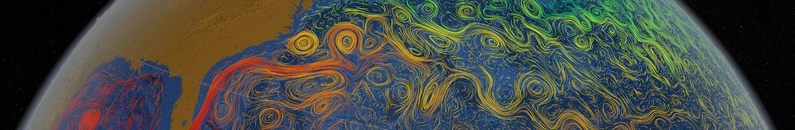

<hr>
<p align="center">
<b style="font-size:30vw;">Ocean subgrid parameterization in an indealized model using machine learning</b>
</p>
<hr>

In this repository, one will find my graduation work which is based on the work made from <a style="text-decoration:none" href="https://www.essoar.org/doi/10.1002/essoar.10511742.1">_Benchmarking of machine learning ocean parameterizations in an idealized model_</a>. Therefore, the goal of this project is to first **reproduce the result** and then **explore further** different configurations of convolutional neural networks.

<hr>
<p  style="font-size:20px; font-weight:bold;" align="center">
<a style="text-decoration:none" href="https://github.com/m2lines/pyqg_parameterization_benchmarks">Introduction</a>
</p>
<hr>

Ocean and climate models attempt to simulate continuous processes, but are discrete and run at finite resolution. The error incurred by discretization on a finite grid, however, can be approximated by _subgrid parameterizations_ and corrected at every timestep. Subgrid parameterizations are attempting to capture the effects of scales that are not resolved on the finite grid of the climate or ocean models we are using. Subgrid parameterizations can be formulated and derived in many ways, e.g. as equations derived by physical analysis, as a neural network learned from data, or as equations again but learned from data with symbolic regression.

<hr>
<p  style="font-size:20px; font-weight:bold;" align="center">
Installation
</p>
<hr>

1. Clone the repository

2. Create an appropriate **Conda** environnement:

```
conda env create -f environment.yml
```

3. Activate the  **Conda** environnement:

```
conda activate TFE
```

4. Install locally as a package:

```
pip install --editable .
```

